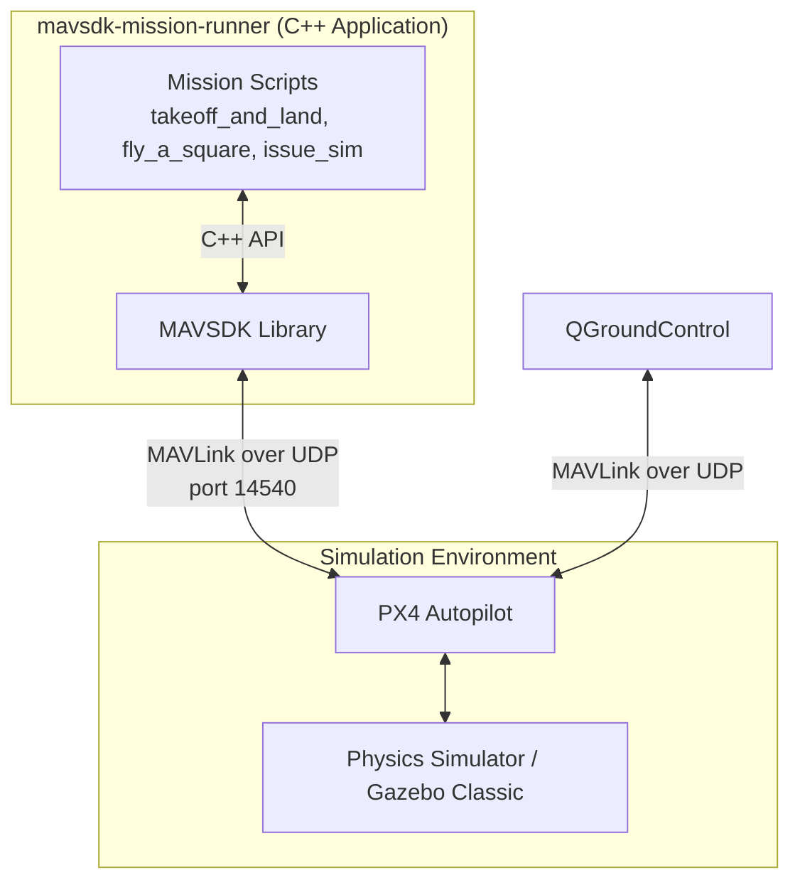
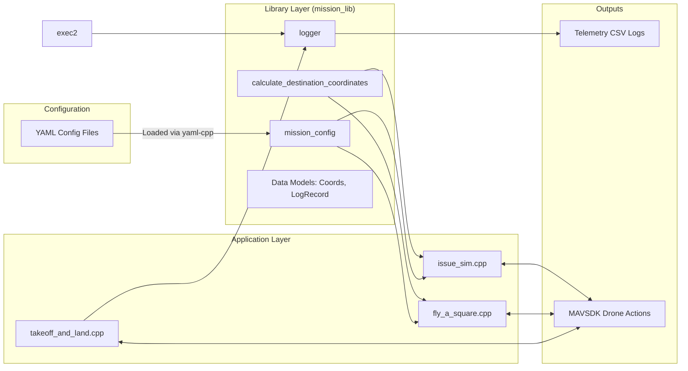

# System Architecture

The `mavsdk-mission-runner` project acts as an offboard control application (Companion Computer) that communicates with a flight controller (PX4 Simulator) via the MAVLink protocol.

## 1. High-Level System Architecture

This diagram illustrates how the components interact in the simulated environment.

- **mavsdk-mission-runner:** Higher level mission logic, writen in C++, utliziing MAVSDK.
- **PX4 Autopilot:** The core flight stack responsible for stabilization and low level navigation.
- **QGroundControl:** The Ground Control Station (GCS) used by human to monitor telemetry, manual overrides, and overall status.

## 2. Internal Software Architecture

The C++ codebase is divided into two primary layers: **Application Layer** (executables) and **Library Layer** (`mission_lib`).

### Component Breakdown
1. Executables (Application Layer): Scripts like `fly_a_square.cpp` and `issue_sim.cpp` orchestrate the MAVSDK setup. They parse command line arguments and load the appropriate configurations, and subscribe to different callbacks e.g. telemetry.
2. `mission_lib` (Library Layer):
    - Data Models: Define pure data structures like `Coords` and `RelativeWaypoint`
    - Mission Config: Parses `.yaml` files to decouple mission waypoints (speeds, altitudes, distances) from hardcode C++ logic.
    - Calculations: Uses `GeographicLib` to calculate absolute GPS coordinates based on relative distance and azimuth.
    - Logger: A thread safe logger that periodically flushes telemetry data (altitude, coordinates, battery) to a `.csv` file.