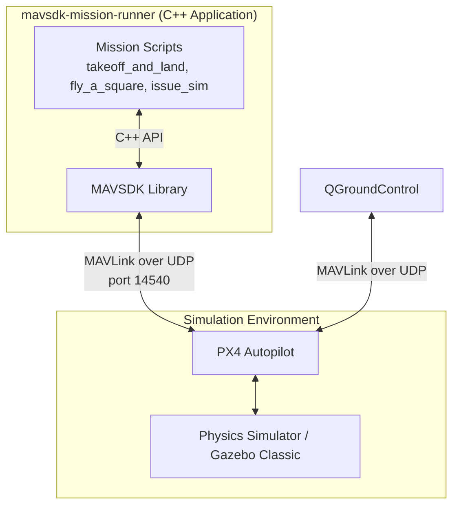

# mavsdk-mission-runner
Simple MAVSDK C++ scripts and YAML configs, for basic exploring and programming behaviours across PX4 and QGroundControl.

It has two major ways of launching a flight:
 - **Relative:** Using distance and azimuth degrees to a current relative position. *(Image 1)*
 - **Absolute:** Fixed set of coordinates(latitude, longitude). *(Image 2)*

Has logging capabilities producing `logs/*.csv` which can be analyzed further. Inferior (but simpler) to native PX4 logging.


-----

<p align="center">
  
  <br>
  <em>Image 1: Relative flight path</em>
</p>

<p align="center">
  
  <br>
  <em>Image 2: Absolute flight path</em>
</p>


## Architecture diagram

High-level overview of components. 



## Quickstart

It can indeed be "started quickly", but what takes time is preparation time. Necessarry components need to be installed, and for each is best following it's respective installation guides. The components are:

1. PX4-Autopilot v1.17.0
2. QGroundControl v5.0.3
3. MAVSDK v3.15.0

Once prerequisites are met, executing following set of commands in sequence will launch the mission. (Note: On first execution, MAVSDK and local source code is going to be compiled, meaning it will take a bit more time to be executed.)

1. In the directory where QGC app image is located:
    - ```chmod +x {Your QGC Filename}```
    - ```./{Your QGC Filename}```
2. In the `PX4-Autopilot` dir:
    -  ```make px4_sitl gazebo-classic```
3. Finally, in the cloned `mavsdk-mission-runner` repo:
    - ```./run_square.sh``` or any other desired script.

If all works well, the UAV in the Gazebo simulation will be armed and will take off.

`run` prefix scripts accept two arguments that dictate what type of mission will it be.

`./run_square.sh relative` will trigger a relative flight path seen on Image 1. 
`./run_square.sh absolute` will trigger a absolute flight path seen on Image 2. 

## What I learned
- First real contact with C++. Got introduced to key components in drone software and sim areas: QGC, PX4, and MAVLink/MAVSDK.
- How drones might work: offboard and missions. Both are of interest, but in this case how uploading a mission might look like.
- Some ways how to handle navigation, GPS, etc. Explored two ways: absolute, and relative. The relative one showed me how my views about navigation, coordinatate calculation was too naive. Also, Earth is a special kind of elipsoid, not a sphere...
- Threading. As Python person, I rarely thought about this. Here I dipped my toes into complex world of threading, mutex, atomis, and how even for simple logging of callbacks, I need to fight for order against some other thread processes (e.g. MAVSDK).
- PX4-Autopilot already handles failsafe. No need to reinvent the wheel (or a rotor).
- Learnt a lessons how I need to meticulously take note of what am I installing, which library version, which binary. Is it source from GitHub or is it .deb package. Once you start recreating it somewhere else e.g. CICD pipelines, sloppy work will prolong this process so much more.
- How generally not easy all of this is, yet quite exciting.

## Future work

- Refactoring and keeping code hygiene. Currently scripts are linear and long. Should be separated into functions for improving readability and testability.
- Speaking of readability, current state of commenting and descriptions is insufficient.
- For each flight, both PX4 and QGC need to be closed and re-opened. It would be useful, purging data programatically and starting new flight fresh to save time.
- Package everything into Docker image so tricky installation process is done by docker daemon, and not a human browsing around the internet.
- Explore further possiblities of Gazebo sim.
